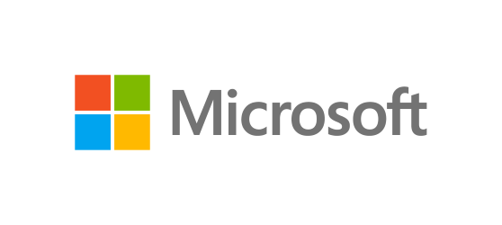
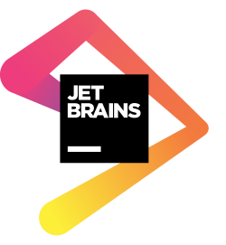

<h1>Il grande evento annuale su DevOps e Continuous Delivery torna come di consueto nel 2020! 

E siamo alla decima edizione!!!</h1>

Quest'anno ci saranno tre track distinte <strong>"Introduttiva"</strong>, <strong>"Consigli e Storie"<strong> e </strong>"Futuro"</strong> coprendo sia temi tecnici che metodologici sulle ultime novitá tecnologiche e sulle best practice del settore.

<h2>Registrazione</h2>

La registrazione è gratuita ma obbligatoria per poter partecipare allevento.

Vai sulla nostra pagina su <strong>***[Eventbrite](https://bit.ly/doaw2020)***</strong>, completa i passaggi richiesti e aggiungi la data al tuo calendario!

								<h1 class="hide-small">
									Agenda
								</h1>
									

	
09:00 - 09:30 <strong>Registrazione</strong>

09:30 - 10:00 <strong>Keynote - dieci anni di DevOps@Work</strong>

10:00 - 10:30 <strong>Keynote - Lorenzo Barbieri (Microsoft)</strong>

10:30 - 11:00 <strong>Coffee break e separazione delle sale</strong>
<h2>Track Introduttiva</h2>
11:00 - 11:45   <strong>La potenza é nulla senza controllo</strong> (Giuliano Latini)

11:55 - 12:40   <strong>Dalla produzione alla QA, provisioning immediato su SQL Server</strong> (Alessandro Alpi)

12:40 - 14:00   <strong>Pranzo</strong>

14:00 - 14:45   <strong>DevOps for Data Scientist</strong> (Stefano Tucci)

15:00 - 15:45   <strong>Testing Pyramid, l'occhio di Ra sul testing</strong> (Felice Pescatore)

15:55 - 16:40   <strong>The art of Azure Functions (unit) testing and monitoring</strong> (Massimo Bonanni)

<h2>Track Consigli e Storie</h2>
11:00 - 11:45   <strong>Azure DevOps for AWS</strong> (Tarun Arora, sessione in inglese)

11:55 - 12:40   <strong>AKS: dal primo commit alla produzione</strong> (Alessandro Melchiori)

12:40 - 14:00   <strong>Pranzo</strong>

14:00 - 14:45   <strong>Usare SQL Server for Linux e Docker per semplificare i processi di testing</strong> (Giulio Vian)

15:00 - 15:45   <strong>Se non sviluppo codice non sto lavorando!!! </strong>(Gian Maria Ricci)

15:55 - 16:40   <strong>Un viaggio verso DevOps</strong> (Daniele Pozzobon)

<h2>Track Futuro</h2>
11:00 - 11:45   <strong>Pattern di resilienza per scenari cloud, su Azure!</strong> (Michele Ferracin)

11:55 - 12:40   <strong>É ora di passare a Pipeline as Code </strong>(Matteo Emili)

12:40 - 14:00   <strong>Pranzo</strong>

14:00 - 14:45   <strong>Having fun with Pulumi</strong> (Andrea Ceroni)

15:00 - 15:45   <strong>Integrare Selenium ed ARM per un testing end-to-end robusto ed efficiente</strong> (Giorgio Di Nardo)

15:55 - 16:40   <strong>Canary Deployment with App Service and Azure DevOps</strong> (Fabrizio Morando, Federico Luciano)

									

							

<h1>Sponsors</h1>

